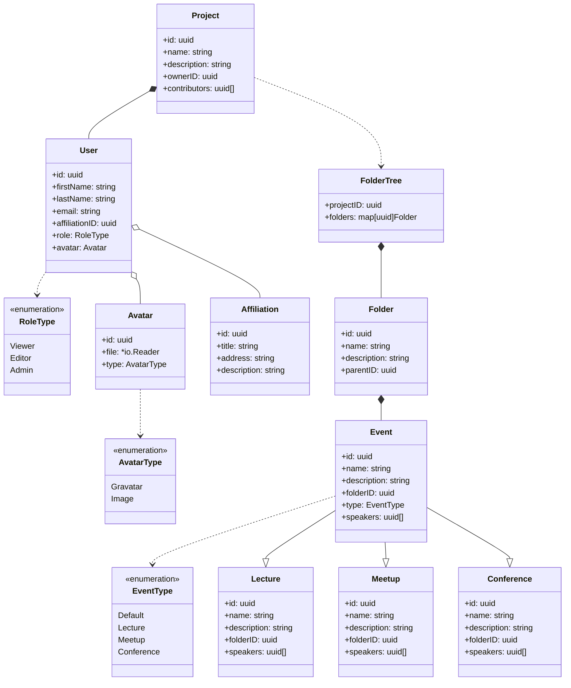

```mermaid
classDiagram
    class User {
        +id: uuid
        +firstName: string
        +lastName: string
        +email: string
        +affiliationID: uuid
        +role: RoleType
        +avatar: Avatar
    }

    class RoleType {
        <<enumeration>>
        Viewer
        Editor
        Admin
    }

    class Avatar {
        +id: uuid
        +file: *io.Reader
        +type: AvatarType
    }

    class Affiliation {
        +id: uuid
        +title: string
        +address: string
        +description: string
    }
    
    class AvatarType {
        <<enumeration>>
        Gravatar
        Image
    }

    User o-- Affiliation
    User o-- Avatar
    User ..> RoleType
    Avatar ..> AvatarType

    class Project {
        +id: uuid
        +name: string
        +description: string
        +ownerID: uuid
        +contributors: uuid[]
    }

    class FolderTree {
        +projectID: uuid
        +folders: map[uuid]Folder
    }

    class Folder {
        +id: uuid
        +name: string
        +description: string
        +parentID: uuid
    }

    Project *-- User
    Project ..> FolderTree

    class Event {
        +id: uuid
        +name: string
        +description: string
        +folderID: uuid
        +type: EventType
        +speakers: uuid[]
    }

    class Lecture {
        +id: uuid
        +name: string 
        +description: string
        +folderID: uuid
        +speakers: uuid[]
    }

    class Meetup {
        +id: uuid
        +name: string 
        +description: string
        +folderID: uuid
        +speakers: uuid[]
    }

    class Conference {
        +id: uuid
        +name: string 
        +description: string
        +folderID: uuid
        +speakers: uuid[]
    }

    class EventType {
        <<enumeration>>
        Default
        Lecture
        Meetup
        Conference
    }

    FolderTree *-- Folder
    Folder *-- Event
    Event ..> EventType
    Event --|> Lecture
    Event --|> Meetup
    Event --|> Conference
```